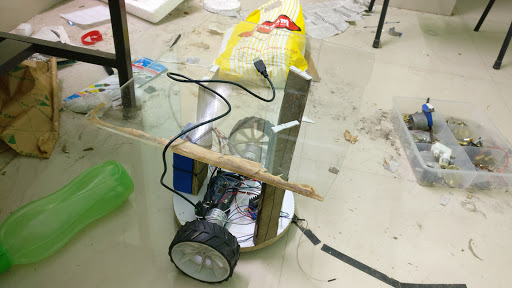
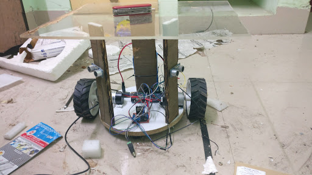

# MiniProject_turtlebot
Try to build a sample turtle bot able to map the area
Dependencies

ROS Kinetic 
gmapping
navstack
rospy
std_msgs
sensor_msgs
SLAM
rosserial

There is One file for the Arduino i.e. Arduino Codes/TurtleBot_arduino
Programs to be run on the server computer are

rosrun rosserial_python serial_node.py _port:=/dev/ttyACM0

python twist_to_motors.py

python diff_tf.py

roslaunch chefbot_bringup keyboard_teleop.launch # control for the keyboard part of the bot taken from an online reposiotty

Now in the ROS Graphs directories there are 2 .dot files 
Basic_graph_driving.dot is the graph which is there for the driving of the bot 
rosgraph.png is the complete graph with the implementaion of SLAM nodes from gamppping.

Here's an image of the robot without the kinect:

